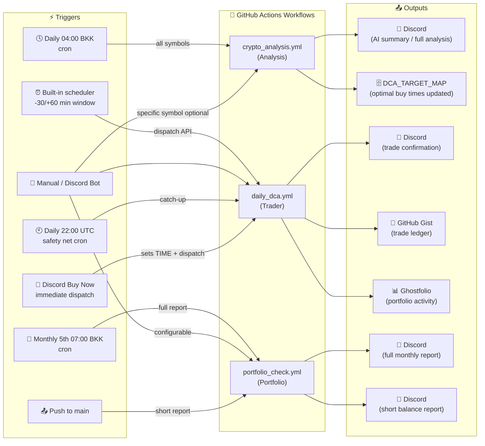
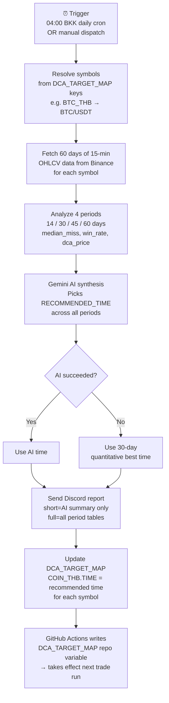
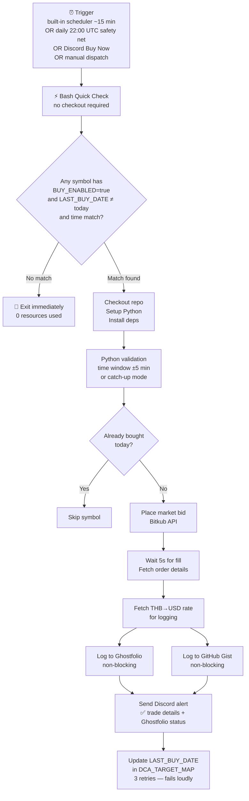
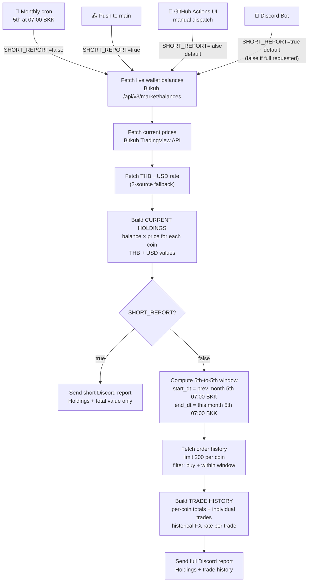

# Smart DCA Automation (Multi-Symbol Analysis + Execution)

A complete system that automatically analyzes market data to find the best time of day to buy for **multiple cryptocurrencies**, and then executes trades automatically on your configured exchange.

The system consists of the following files:

| File | Role |
|------|------|
| `bitkub_client.py` | Shared API client — HMAC signing, server-time sync, FX rates. Used by all other modules. |
| `crypto_analysis.py` | Daily market analysis using CCXT + Gemini AI. Updates `DCA_TARGET_MAP` with optimal buy times. |
| `crypto_dca.py` | Trade executor — reads `DCA_TARGET_MAP`, places market buy orders, logs to Gist + Ghostfolio. |
| `portfolio_balance.py` | Portfolio reporter — fetches balances, calculates THB/USD value, sends Discord report. |
| `portfolio_logger.py` | Logs individual trades to Ghostfolio portfolio tracker. |
| `gist_logger.py` | Appends trade records to a GitHub Gist as a markdown ledger. |
| `discord_bot.py` | Discord bot — natural language control of workflows and DCA config. Runs separately. |

**Workflows** (`.github/workflows/`):

1. **`crypto_analysis.yml`** — Runs daily (04:00 BKK / 21:00 UTC). Analyzes **60 days** of price data across **4 periods** (14, 30, 45, 60 days) for **all pairs in `DCA_TARGET_MAP`** to find the "Champion Time" for each. Uses AI synthesis to pick optimal buy time. Updates `DCA_TARGET_MAP`.
2. **`daily_dca.yml`** — Triggered on **manual dispatch** + **daily 22:00 UTC safety net** (05:00 Bangkok). Checks if current time matches target time for any enabled symbol. Executes market buy orders.
3. **`portfolio_check.yml`** — Runs **monthly on the 5th at 07:00 BKK** (00:00 UTC). Fetches balances for all configured coins, calculates portfolio value in THB and USD, includes the previous month's trade history (5th-to-5th window), sends Discord report. Also runs on every push to main (short balance-only report).

## System Orchestration



## Features

- **Multi-Symbol Support**: Analyze and trade multiple pairs independently (e.g., BTC at 23:00, LINK at 23:45).
- **Self-Optimizing**: Buy time adjusts daily based on 60-day historical analysis with AI-powered recommendations.
- **Configurable Report Verbosity**: Analysis workflow supports short (AI summary only) or full (detailed breakdown) Discord reports.
- **Portfolio Balance Tracking**: Automatic monthly balance checking and reporting via Discord with real-time valuations in THB and USD. Short balance-only report on every push to main.
- **Multi-Layer Safeguards**: Prevents double-buying with `LAST_BUY_DATE` tracking and workflow concurrency control.
- **Detailed Logging**: All trades logged to GitHub Gist with THB and USD amounts for portfolio tracking.
- **Portfolio Integration**: Automatic trade logging to Ghostfolio portfolio tracker with 8-decimal precision and timezone-aware timestamps.
- **Discord Integration**: Real-time notifications for trades (with THB+USD amounts and Ghostfolio status), errors, and critical alerts including FX rate failures.
- **Timezone Aware**: Fully configurable timezone support via `TIMEZONE` env variable (defaults to Asia/Bangkok).
- **Non-Blocking Logging**: Trade execution succeeds even if Gist or Ghostfolio logging fails (errors logged and notified).

### 1. Secrets (Secure Storage)
Go to `Settings` -> `Secrets and variables` -> `Actions` -> `New repository secret`:

| Secret Name | Value Description |
| :--- | :--- |
| `BITKUB_API_KEY` | Your exchange API Key. |
| `BITKUB_API_SECRET` | Your exchange API Secret. |
| `GEMINI_API_KEY` | Google AI Studio Key. |
| `DISCORD_WEBHOOK_URL` | Your Discord Webhook URL. |
| `GH_PAT_FOR_VARS` | Personal Access Token (Classic) with `repo` and **`gist`** scope. Used to update variables and write to your log. |
| `GIST_TOKEN` | (Same as GH_PAT_FOR_VARS) Token used specifically by the python script to update Gists. |
| `GIST_ID` | The ID of your `trade_log.md` gist. |
| `GHOSTFOLIO_TOKEN` | Your Ghostfolio access token for portfolio logging. |

### 2. Variables (Configuration)
Go to `Settings` -> `Secrets and variables` -> `Actions` -> `New repository variable`:

| Variable Name | Example Value | Description |
| :--- | :--- | :--- |
| `DCA_TARGET_MAP` | `{"BTC_THB": {"TIME": "07:00", "AMOUNT": 800, "BUY_ENABLED": true, "LAST_BUY_DATE": "", "DYNAMIC_DCA": {"ENABLED": true, "THRESHOLD_PERCENT": -2, "REDUCED_MULTIPLIER": 0.5}}}` | **Key config.** Dictionary mapping Symbol to settings (time, amount, enabled state, last buy date, and optional dynamic DCA policy). |
| `TIMEZONE` | `Asia/Bangkok` | Timezone for operations. |
| `PORTFOLIO_ACCOUNT_MAP` | `{"BTC": "3cced5d3-f219-47c8-bb73-878466060d7a", "DEFAULT": "9069984b-3c2b-48d8-831d-b7d73b5bafb7"}` | Maps crypto symbols to Ghostfolio account IDs. Falls back to DEFAULT if symbol not found. |
| `GHOSTFOLIO_URL` | `https://ghostfol.io` | Ghostfolio instance URL (optional, defaults to https://ghostfol.io). |

### Dynamic DCA

Set `DYNAMIC_DCA.ENABLED` to `true` for each asset that should use the policy.
The bot reads that asset's lifetime, account-scoped Ghostfolio ROI (including
currency effect) before placing the order:

- ROI at or above `THRESHOLD_PERCENT` (default `-2`) buys `AMOUNT * REDUCED_MULTIPLIER` (default `0.5`).
- ROI below the threshold buys the configured `AMOUNT` at `x1`.
- Missing, invalid, or unavailable Ghostfolio ROI also buys the configured `AMOUNT` at `x1`.
- If the reduced amount would be below Bitkub's 10 THB minimum, the bot buys the configured `AMOUNT` at `x1`.

Every successful DCA Discord notification includes the asset ROI and the full- or half-buy reason.

### 3. Workflow Configuration

**Analysis Workflow (`crypto_analysis.yml`)**:
- **Schedule**: Daily at 21:00 UTC (04:00 Bangkok)
- **Trigger**: Daily schedule or manual dispatch
- **Concurrency**: Only one analysis runs at a time (cancel-in-progress)
- **Environment**: Uses `binanceus` exchange to avoid geo-restrictions
- **Symbol Resolution**: Automatically derives symbols from `DCA_TARGET_MAP` keys (e.g., `BTC_THB` → `BTC/USDT`). Override with explicit `symbol` input on manual dispatch.
- **Report Mode**: Configurable via `short_report` input (default: true)
  - **Short Report (true)**: Sends AI summary only (~8 lines) - ideal for daily automated runs
  - **Full Report (false)**: Sends detailed analysis with all time period breakdowns - use for deep dives

**Trader Workflow (`daily_dca.yml`)**:
- **Trigger**: Manual dispatch + **daily 22:00 UTC cron** (05:00 Bangkok) as a safety net in case the Discord bot or external cron is down
- **Concurrency**: Only one trade workflow runs at a time (queued, not cancelled)
- **Pre-Check**: Bash Quick Check runs first (no checkout/Python needed). Only checks out code and installs dependencies if a trade is needed
- **Safeguards**: Multiple layers check `BUY_ENABLED`, `LAST_BUY_DATE`, and time window
- **Rationale**: Manual dispatch gives you full control over when trades execute. Analysis updates DCA_TARGET_MAP daily, but you decide when to run the trader

**Portfolio Balance Workflow (`portfolio_check.yml`)**:
- **Schedule**: Monthly on the 5th at 07:00 Bangkok time (00:00 UTC)
- **Trigger**: Also runs on every push to main + manual dispatch available
- **Optimized**: Only installs minimal dependencies (requests library), uses pip caching for speed
- **Report Mode**: Adaptive based on trigger
  - **Short Report (push)**: Current holdings and total value only - fast status check
  - **Monthly Full Report (5th)**: Current holdings plus the exact previous month's trade history (5th 07:00 BKK → 5th 07:00 BKK)
  - **Manual dispatch (GitHub Actions UI)**: Full monthly report by default (`short_report` input defaults to `false`)
  - **Manual dispatch (Discord Bot)**: Short report by default — say "full portfolio" or "portfolio with trades" for the full monthly report
- **Report**: Fetches balances for all coins in DCA_TARGET_MAP, calculates portfolio value, sends Discord notification

## How It Works

### Daily Analysis Cycle



1. At 04:00 Bangkok time, `crypto_analysis.yml` triggers
2. Resolves symbols from `DCA_TARGET_MAP` keys (e.g., `BTC_THB` → `BTC/USDT`, `LINK_THB` → `LINK/USDT`, `SUI_THB` → `SUI/USDT`). Can be overridden via explicit input.
3. Fetches 60 days of 15-minute OHLCV data from Binance for each symbol
4. Calculates metrics: `median_miss`, `win_rate`, `dca_price` for each 15-min slot
5. Gemini AI synthesizes recommendation across 14/30/45/60-day periods
6. Sends Discord report (short AI summary by default, full analysis if configured)
7. Updates `DCA_TARGET_MAP["<SYMBOL>_THB"]["TIME"]` with optimal buy time for each pair

### Trade Execution Cycle



1. **Trigger** via built-in DCA scheduler (-30/+60 min window), daily 22:00 UTC safety net cron, Discord "Buy Now" command, or manual GitHub Actions UI dispatch
2. **Bash Quick Check** (no checkout/Python required): Filters by `BUY_ENABLED`, `LAST_BUY_DATE`, time window
3. If no match → Workflow ends (fast exit, no resources used)
4. If match found → Checkout repo → Setup Python → Install deps → Run Python
5. **Python**: Validates time window (±5 min or catch-up), checks `LAST_BUY_DATE`
6. Places market bid order (waits 5 seconds for fill)
7. Fetches THB→USD exchange rate for logging
8. **Logs to Ghostfolio** (non-blocking): Authenticates with 30s timeout, creates activity with 8-decimal precision, maps symbol to account (falls back to DEFAULT)
9. **Logs to Gist** (non-blocking): Records trade with THB+USD amounts and Ghostfolio save status
10. Sends Discord alert with trade details and Ghostfolio status
11. Updates `LAST_BUY_DATE` with 3 retries (fails loudly on error)

**Daily Safety Net**: The 22:00 UTC cron ensures trades still execute even if the Discord bot or external cron service is down. The bash quick-check's `DIFF >= -5` logic means it catches any enabled symbol whose target TIME has already passed today, while `LAST_BUY_DATE` prevents double-buys if the bot already triggered it earlier.

**Automating the trigger (optional)**: To run the trader automatically every 15 minutes without adding a cron schedule to the workflow itself, you can call the `workflow_dispatch` API externally:
- **Local cron job**: Add a crontab entry on any always-on machine: `*/15 * * * * curl -s -X POST -H "Authorization: token YOUR_PAT" -H "Accept: application/vnd.github.v3+json" https://api.github.com/repos/YOUR_USER/YOUR_REPO/actions/workflows/daily_dca.yml/dispatches -d '{"ref":"main"}'`
- **Online cron service**: Use [cron-job.org](https://cron-job.org/en/) (free) — point it at the same GitHub API URL above with your PAT in the `Authorization` header, scheduled every 15 minutes. The workflow's Bash Quick Check will exit immediately if no trade is due, so unnecessary triggers are near-free.

## Portfolio Balance Reporting

The balance checker provides automated portfolio tracking and valuation:



### Features
- **Multi-Coin Support**: Automatically fetches balances for all coins in `DCA_TARGET_MAP`
- **Real-Time Pricing**: Gets current market prices from Bitkub API
- **Dual Currency**: Shows values in both THB and USD
- **Configurable Report Verbosity**: Short (balance only) or full (with trade history)
- **Automated Reports**: Monthly full report on the 5th + short balance-only report on every push to main
- **Discord Notifications**: Formatted report with individual coin balances and total portfolio value

### Report Format

**Short Report** (on push):
```
📊 CURRENT HOLDINGS

BTC
  Amount: 0.00084835
  Price: ฿2,113,889.19
  Value: ฿1,793.32 ($57.41)

LINK
  Amount: 5.01449152
  Price: ฿277.11
  Value: ฿1,389.57 ($44.48)

💰 Total Portfolio Value
฿3,182.88
$101.89
```

**Full Report** (monthly schedule or manual):
Includes all of the above PLUS:
```
════════════════════════════════════════
📈 TRADE HISTORY (Feb 05 → Mar 05, 2026)

BTC (19 trades) — Crypto amount: 0.00446910 — Spent: ฿6,949.95 ($223.75)
• 2026-03-04 23:00 +07 - 0.00042594 BTC - Order ID: 69a04e8a93 - Price: ฿2,112,938.03 ($68,036.6000) - Spent: ฿899.99 ($28.98)
...

LINK (10 trades) — Crypto amount: 14.66775216 — Spent: ฿2,400.00 ($77.24)
• 2026-03-04 23:45 +07 - 1.04260791 LINK - Order ID: 69a04e9aa0 - Price: ฿287.74 ($9.2668) - Spent: ฿300.00 ($9.66)
...
```

### Schedule
- **Monthly (Full Report)**: Every 5th of the month at 07:00 Bangkok time - includes exact 5th-to-5th trade history
- **On Push (Short Report)**: After every commit to main branch - balance only for quick checks
- **Manual (Short Report by default)**: Can be triggered via GitHub Actions UI or Discord bot — shows balance only unless full report is explicitly requested

## Currency Conversion

The system fetches real-time THB→USD exchange rates from multiple sources:
- **Primary**: Frankfurter API (`api.frankfurter.app`)
- **Secondary**: Open Exchange Rate API (`open.er-api.com`)
- **Fallback**: If all sources fail, USD values show as `$0.00` and an error notification is sent to Discord

## Portfolio Logging

Trades are automatically logged to Ghostfolio for portfolio tracking:
- **Account Mapping**: Maps crypto symbols to Ghostfolio accounts via `PORTFOLIO_ACCOUNT_MAP` (falls back to DEFAULT)
- **Precision**: 8-decimal quantity formatting (e.g., 0.00012345 BTC), 4-decimal USD unit price (e.g., $0.8895 SUI)
- **Comment Format**: `฿800.00 - $25.10 - tx_abc123de` (shows THB, USD, and exchange order ID)
- **Data Source**: Yahoo Finance (BTCUSD, LINKUSD, etc.) - free tier compatible
- **Timezone Support**: Uses configured TIMEZONE, converts to UTC for Ghostfolio
- **Timeout**: 30 seconds for all Ghostfolio API requests (doubled from standard)
- **Error Handling**: Non-blocking - trade executes even if Ghostfolio fails (errors logged to console and Discord)
- **Gist Integration**: "Saved" column reflects Ghostfolio logging success (`true`/`false`)

## Safeguards Against Double-Buying

| Layer | Location | Check | Prevents |
|-------|----------|-------|----------|
| **Concurrency** | GitHub Actions | Only 1 workflow runs at a time | Race conditions |
| **Bash Filter** | Quick Check step | `LAST_BUY_DATE == today` | Unnecessary Python execution |
| **Python Filter** | Symbol processing | `BUY_ENABLED == false` | Disabled symbols |
| **Time Window** | `is_time_to_trade()` | Within ±5 min or catch-up | Out-of-window execution |
| **Date Check** | Per-symbol loop | `LAST_BUY_DATE == today` | Same-day duplicate |
| **API Update** | Post-trade | 3 retries, fail loudly | Silent failure risk |

## Discord Bot (Natural Language Control)

A self-hosted Discord bot (`discord_bot.py`) that lets you control the DCA system via natural language chat.

### Capabilities
- **Trigger Analysis**: "Run analysis" (analyzes all symbols in DCA config) / "Analyze BTC" (specific symbol)
- **Check Portfolio**: "Show balance" / "Portfolio report"
- **View Config**: "Show status" / "What's the current config?"
- **View Accounts**: "Show accounts" / "Portfolio account map"
- **Update DCA Config**: "Set BTC amount to 600" / "Set BTC time to 22:00" / "Disable LINK"
- **Buy Now**: "Buy LINK now" / "Purchase SUI immediately" — sets TIME to next quarter hour, enables the symbol, and dispatches the workflow immediately

All commands are interpreted via Gemini AI — just type naturally.

### Setup

1. **Create a Discord Application** at [discord.com/developers](https://discord.com/developers/applications)
2. Under **Bot** settings, enable **Message Content Intent**
3. Generate a **Bot Token** and invite the bot to your server (Send Messages, Read Messages permissions)
4. Install dependencies: `pip install -r bot_requirements.txt`
5. Set environment variables and run:

```bash
export DISCORD_BOT_TOKEN="your-bot-token"
export GEMINI_API_KEY="your-gemini-key"
export GH_PAT="your-github-pat"           # Same PAT as GH_PAT_FOR_VARS (repo scope)
export GITHUB_REPO="owner/repo"            # e.g. "simon/DCA-Analysis"
export DISCORD_CHANNEL_ID="123456789"      # Optional: restrict to one channel
export DISCORD_ALLOWED_USERS="111,222"     # Optional: restrict to specific Discord user IDs
export DCA_CRON_ENABLED="true"             # Optional: enable built-in DCA scheduler
export TIMEZONE="Asia/Bangkok"             # Optional: timezone for scheduler (default: Asia/Bangkok)

python discord_bot.py
```

### Behaviour
- **With `DISCORD_CHANNEL_ID` set**: Bot responds to all messages in that channel
- **Without it**: Bot only responds to @mentions and DMs
- **With `DISCORD_ALLOWED_USERS` set**: Only listed user IDs can trigger actions
- **DCA updates are validated**: AMOUNT must be 50–2000 THB, inclusive; TIME must be HH:MM; BUY_ENABLED must be bool. Cannot add/remove symbols — only update existing ones.

### Built-in DCA Scheduler
When `DCA_CRON_ENABLED=true`, the bot replaces the need for an external cron service (e.g., cron-job.org) by dispatching `daily_dca.yml` at the right times:
- Reads target buy times from `DCA_TARGET_MAP` and triggers the workflow within a **-30/+60 min window** (clock-aligned ticks at :00, :15, :30, :45), giving ~7 attempts per target to handle GitHub Actions flakiness
- Status and update commands show planned dispatch times so you can verify the schedule at a glance
- Schedule refreshes **every 30 minutes**, on **startup**, and **opportunistically** whenever any Discord command reads/updates `DCA_TARGET_MAP`. A Discord notification is sent if the schedule changes or if the GitHub API call fails during refresh
- The `daily_dca.yml` bash quick-check still handles all safety logic (time matching, double-buy prevention), so early triggers exit cheaply

### Hosting
The bot runs separately from GitHub Actions — anywhere with Python 3.9+ and internet:
- Local machine / Raspberry Pi
- Free tier: [Railway](https://railway.app), [Render](https://render.com), [Fly.io](https://fly.io), [Oracle Cloud free VM](https://www.oracle.com/cloud/free/)

